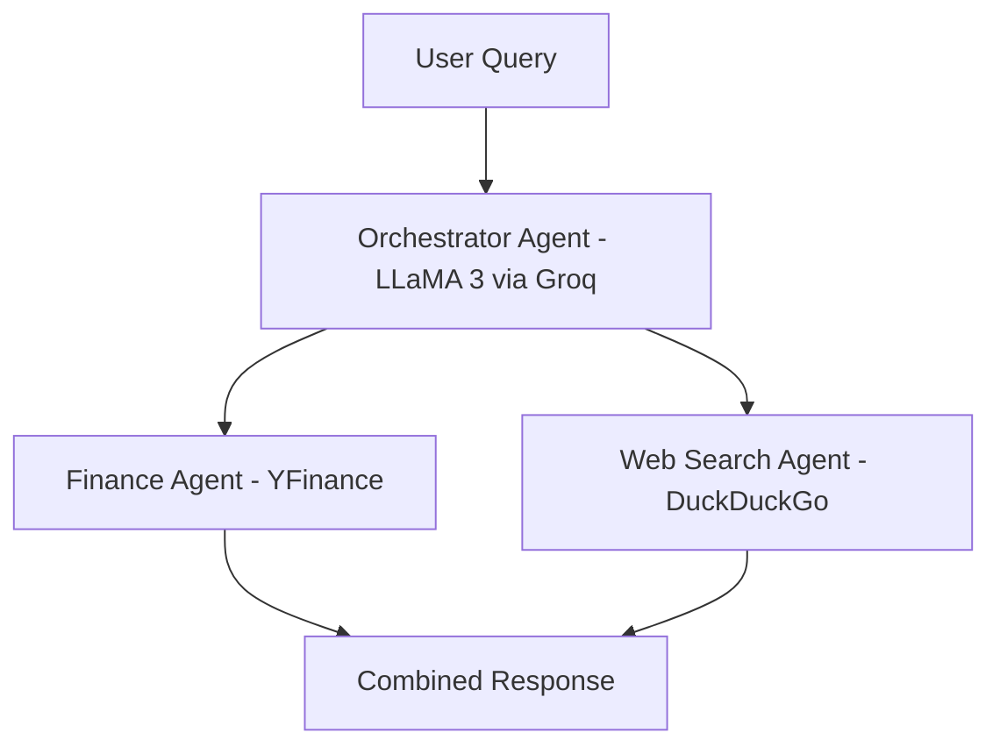

# Multi-Agent-Financial-Research-Assistant
A multi-agent AI system that acts like a personal stock research assistant. You type in a stock name, and it automatically searches the web for latest news AND fetches live financial data at the same time, then gives you one combined summary. No manual Googling, no switching between tabs.  Built with Phidata, Groq, YFinance, and DuckDuckGo
# What It Does
Most stock research tools make you jump between tabs. This project uses two specialist AI agents working together, coordinated by an orchestrator, so you get financial data AND news in one single response.
You ask: "Summarise analyst recommendations and share the latest news for NVDA"
The system figures out the rest.
# Architecture

# Getting Started:
**1. Clone the repo**
```bash
git clone https://github.com/raaheel4/multi-agent-financial-research-assistant
cd multi-agent-financial-research-assistant
```

**2. Install dependencies**
```bash
pip install -r requirements.txt
```

**3. Get your API keys**
You need two free API keys to run this project.

🔑 Groq API Key (for the LLM)
Groq gives you free access to LLaMA 3 — no credit card needed.

Go to console.groq.com
Sign up or log in
Click API Keys in the left sidebar
Click Create API Key, give it a name, and copy the key
🔑 Phidata API Key (for the Playground UI)

This is only needed if you want to use playground.py — the visual browser UI.

Go to phidata.app

Sign up or log in

Go to Settings and find your API key
Copy it

**If you only want to run FinancialAI.py from the terminal, you only need the Groq key.**

**4. Set up your .env file**

Create a file named .env inside the code folder and add your keys:

Add your API key
```example.env
# Add your Groq API and PHY_API key inside .env
PHI_API_KEY=your_key_here
GROQ_API_KEY=your_key_here
```

**5. Run the agent**
```python
multi_ai_agent.print_response("Latest news for NVDA", stream=False)
```
If you want the visual Playground UI in your browser:
```
python playground.py
```

# Models Used  
The project uses LLaMA 3.1 8B Instant served via Groq for all three agents. You can swap to a more powerful model like llama-3.3-70b-versatile in FinancialAI.py if you want stronger responses.

# About 
Built as a hands-on introduction to agentic AI systems. This project explores multi-agent orchestration, tool use, and real-time data retrieval using open-source LLMs running on free infrastructure.
