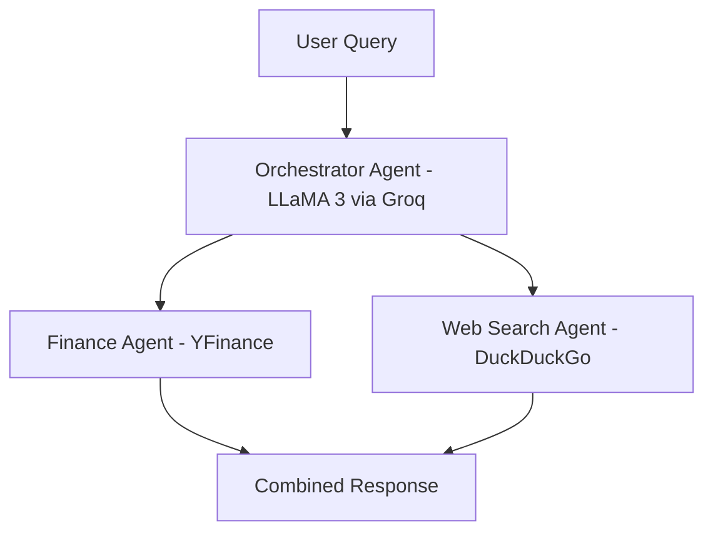

# Multi-Agent-Financial-Research-Assistant
A multi-agent AI system that acts like a personal stock research assistant. You type in a stock name, and it automatically searches the web for latest news AND fetches live financial data at the same time, then gives you one combined summary. No manual Googling, no switching between tabs.  Built with Phidata, Groq, YFinance, and DuckDuckGo
# What It Does
Most stock research tools make you jump between tabs. This project uses two specialist AI agents working together, coordinated by an orchestrator, so you get financial data AND news in one single response.
You ask: "Summarise analyst recommendations and share the latest news for NVDA"
The system figures out the rest.
# Architecture

# Getting Started:
**1. Clone the repo**
```bash
git clone https://github.com/raaheel4/FinancialAI.py
cd FinancialAI.py
```

**2. Install dependencies**
```bash
pip install -r requirements.txt
```

**3. Add your API key**
```example.env
# Add your Groq API and PHY_API key inside .env
PHI_API_KEY=your_key_here
GROQ_API_KEY=your_key_here
```

**4. Run the agent**
```python
multi_ai_agent.print_response("Latest news for NVDA", stream=False)
```
